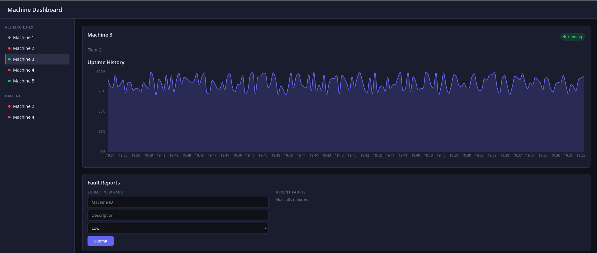

# Kal-Dashboard

A full-stack manufacturing dashboard built to simulate the kind of system used at a plastics compounding facility. Built as interview preparation for a Full Stack Developer co-op role at Kal-Polymers.



## Stack
- **Frontend:** React, Vite, Recharts, CSS
- **Backend:** Python, Flask, SQLite, flask-cors
- **Simulated data source:** Python mock sensor script (simulates a Raspberry Pi reading from PLCs/sensors)

## Architecture

```
┌─────────────────┐         ┌─────────────────┐         ┌──────────────┐
│  React Frontend  │  fetch  │  Flask Backend   │  query  │   SQLite DB  │
│                 │ ──────► │                 │ ──────► │              │
│ - Machine list  │ ◄─────  │ GET /api/machines│ ◄─────  │ - machines   │
│ - Fault panel   │  JSON   │ GET /api/logs/:id│  rows   │ - machine_logs│
│ - Recharts graph│         │ GET /api/faults  │         │ - faults     │
│ - Dark UI       │         │ POST /api/faults │         │              │
└─────────────────┘         │ PUT /api/faults  │         └──────────────┘
                            └─────────────────┘
                                     ▲
                             ┌───────┴───────┐
                             │ mock_sensor.py │
                             │               │
                             │ Simulates a   │
                             │ Raspberry Pi  │
                             │ inserting new │
                             │ sensor readings│
                             │ every 5s      │
                             └───────────────┘
```

## Features
- **Live machine status** — React polls Flask every 10 seconds for current machine status
- **Green/red status indicators** — colour coded dots and badges for running/offline machines
- **Offline machine panel** — sidebar filters and highlights machines currently offline
- **Selected machine detail** — click any machine to see status, location, and uptime chart
- **Uptime chart** — Recharts AreaChart showing real time-series uptime data from SQLite
- **Fault reporting** — operators can submit fault reports with severity levels (low/medium/high)
- **Simulated sensor data** — mock_sensor.py inserts a new log entry every 5 seconds per machine

## Folder Structure

```
kal-dashboard/
├── backend/
│   ├── app.py            ← Flask REST API (6 endpoints)
│   ├── database.py       ← SQLite schema, seed data, get_db helper
│   ├── mock_sensor.py    ← simulates Pi pushing sensor readings every 5s
│   ├── requirements.txt  ← flask, flask-cors
│   └── dashboard.db      ← SQLite file (auto-created on first run)
├── frontend/
│   ├── src/
│   │   ├── App.jsx           ← root, sidebar layout, selected machine state
│   │   ├── MachineList.jsx   ← machine list, polling every 10s, onSelect
│   │   ├── FaultPanel.jsx    ← fault list + submit form, POST to Flask
│   │   └── UptimeChart.jsx   ← Recharts AreaChart, re-fetches on machine change
│   ├── src/index.css         ← dark theme, cards, status dots, severity badges
│   └── vite.config.js
└── README.md
```

## How to Run

**Backend:**
```bash
cd backend
python -m venv venv
source venv/bin/activate       # Windows: venv\Scripts\activate
pip install -r requirements.txt
python database.py             # creates and seeds the database
python mock_sensor.py          # start sensor simulation (keep running in background)
python app.py                  # start Flask server on localhost:5000
```

**Frontend:**
```bash
cd frontend
npm install
npm run dev                    # starts Vite on localhost:5173
```

## API Endpoints

| Method | Endpoint | Description |
|--------|----------|-------------|
| GET | /api/machines | All machines |
| GET | /api/machines/\<id\> | Single machine |
| GET | /api/logs/\<machine_id\> | Logs for a machine, ordered by time |
| GET | /api/faults | All fault reports |
| POST | /api/faults | Submit a new fault report |
| PUT | /api/faults/\<id\> | Mark a fault as resolved |
